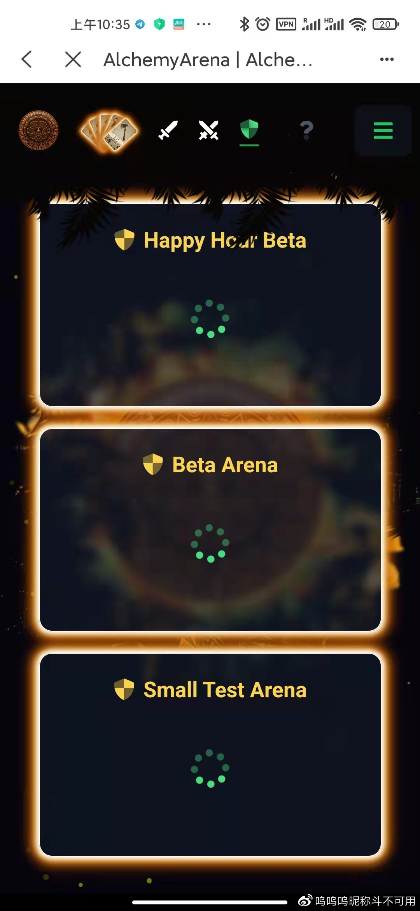

# 炼金术竞技场建议攻略

> Beta Arena的质押奖励明天要取消啦，提醒大家记得提前把质押奖励取走。

**现有竞技场**：

进入竞技场页面，可以看到三个竞技场：Happy Hour Beta, Beta Arena, Small Test Arena。其中，目前活跃的竞技场为前两个竞技场。Small Test Arena由于没有质押奖励，不建议大家参与。

竞技场机制简析：进入竞技场，首先要以5张GAT卡牌（至多一张八级卡，四至五张一级～七级的卡牌）组成一个Hand。在Hand被质押入竞技场时，一定数量的GAT（即入场费）会附着在Hand上，玩家可以用XP来强化自己的Hand。

当Hand主动挑战/被其他Hand挑战时，获胜方会赢取失败方的入场费，失败方强度10%的XP，及失败方Hand中的一张最弱牌。失败方将获得获胜方强度10%的XP，并失去自己Hand中的一张最弱牌。获胜方/失败方都能获得Hand在竞技场中存活期间的质押奖励。

Happy Hour Beta和Beta Arena竞技场的质押奖励分别为750XP/天和0.1GAT/天（带大圆盘就是1500XP/天和0.2GAT/天）,入场费分别为2GAT和1GAT。

Happy Hour Beta竞技场的质押奖励（按市价算）约为Beta Arena的三倍，但入场费为Beta Arena的两倍，且有特殊的Happy Hour机制。

Happy Hour：每隔10小时，Happy Hour Beta中Hand的挑战上限会由30降到10（即：原本池子中有30只Hand才可以发动攻击，现在只要池子中有10只Hand就可以发动攻击）。

由于Happy Hour机制的存在，Happy Hour Beta竞技场中的流动性比Beta Arena大得多，建议新人在参与前衡量好风险收益比。

**Beta Arena的质押奖励明天要取消啦，提醒大家记得提前把质押奖励取走。以后暂时应该只有Happy Hour Beta一个场子可以玩了。**

**给项目方建议**：

1. 可以多和其他项目方合作，建立一些奖励为其他项目代币的竞技场，提高竞技场的可玩性。

2. 可以举办类似之前挑战赛的活动，拿出一部分GAT来鼓励玩家在两个竞技场中进行挑战，提高竞技场活跃度。        

