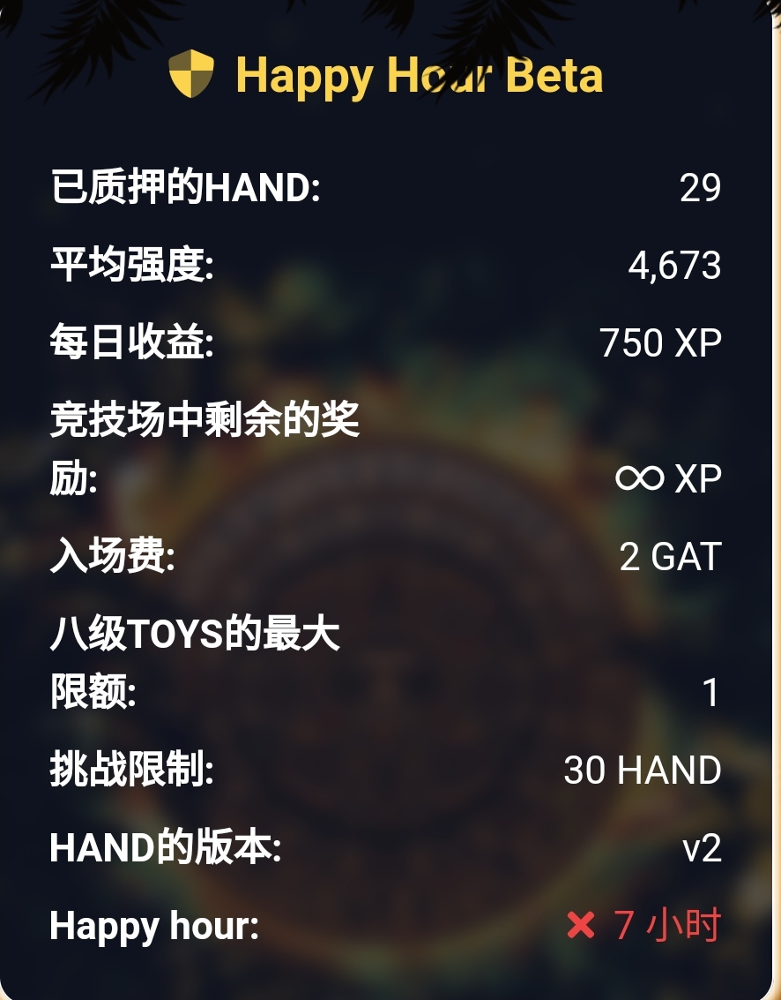

# 炼金术竞技场 (Alchemy Arena)

炼金术竞技场 (Alchemy Arena) 被设计为一款卡牌对战游戏，本质上是将第一个游戏中获取的**卡牌NFT质押**并获取质押奖励，除此之外，引入了一系列设计以提高可玩性：

- [炼金术竞技场 (Alchemy Arena)](#炼金术竞技场-alchemy-arena)
  - [游戏界面](#游戏界面)
  - [常见问题 FAQ](#常见问题-faq)

> 等级越高，战力越强；序号越低，战力越强。

1. 质押可以选择不同的竞技场，规则是不一样的，并且竞技场游戏计划**为其他项目提供启动平台（launchpad），质押获取他们的代币**，因此，质押获取的奖励将会多种多样，**规则也是可以弹性调整**的，目前存在的竞技场有两个，一个挖GAT，一个挖XP。

以happy hour竞技场（欢乐场）为例，规则如下：

* 入场费为2GAT(以相对于gas费增加挑战费用/奖励)
* 质押奖励为每天750 xp
* 手的战力上限是6000; XP 的最大强化战力是平均战力的20% 以上。袖珍火箭允许超过20% 的战力上限，但在任何情况下，硬上限是在6000战力。
* 游戏并不是完全确定的，总是有一个小的机会，一个较弱的手将会赢
* 攻击手在攻击时手的战力增加10%
* 每只手最多有一个特殊的玩具
* 一只手中最弱的玩具将在一只手被打败时丢失
* 新放置的手有一个冷却时间然后才可以在竞技场上挑战
* 正常情况下，至少要有30只手才能进行挑战
* 每12.5小时(以确保它能在不同时区旋转) ，最小挑战手数减至10只手1小时

> XP、GAT、卡牌（NFT）是 GAT生态里的三大通证。

3. 质押的手可以采取两种策略：**进攻** 和 **防守**。防守类似于普通的质押，可以获取质押奖励。

点击图中的“**挑战**”即可发起进攻，为了鼓励进攻以提高游戏的经济性（因为早期测试玩家倾向于和平相处挖矿），新竞技场现在会给进攻方一定的战力加成。

- 进攻方胜：获得守方的门票奖励（GAT）和对方的一张卡牌。
- 进攻方输：失败的手将会被打散，门票被守方赢得，并丢失一张卡牌（永久销毁）。

> 门票 GAT 的5%也会在质押时被永久销毁。

## 游戏界面

切换中文：

查看自己的卡牌：

查看自己已经质押的手：

查看现有的竞技场：

## 常见问题 FAQ

1. 游戏入口？

 https://alchemyarena.com/?a=0x9a818a78d665224Dfb84771d86fD54611788FD70

2. 游戏合约是否审计？

该游戏合约由 Solidity Finance 审计，审计报告：https://solidity.finance/audits/AlchemyToysArena/

3. 什么是特殊卡牌？

Alchemy Toys 最多可容纳63个特殊玩具。这些 NFT 在 Alchemy Toys 中没有功能，但它们在Alchemy Arena（竞技场）游戏中发挥重要作用——而且它们具有很高的收藏价值，因为它们中的大多数都是有限的。

中文区教程介绍：https://github.com/GAT-Network/Chinese-Tutorial/blob/main/specialtoys.md

4. 有视频教程吗？

请查看社区自建的中文区教程汇总：https://github.com/GAT-Network/Chinese-Tutorial

5. 回本周期？游戏能打金吗？

竞技场的打金策略很简单，只有两种：

- 和平挖矿，大家很少发起挑战，这种情况在前两轮公测期间很常见。
- 积极进攻，一只手赢有一只手输，只要根据策略调整让自己胜的概率提高，在多次大量质押的情况下，就可以获取收益。

竞技场游戏经过了alpha、beta两轮公测，已经逐渐成熟，根据不同竞技场的规则可以选择自己的策略，以下是可以根据策略进行调整的：

- 卡牌战力值
- 进攻还是防守？
- 选用哪张特殊卡牌？

基于竞技场的复杂性，决定策略的不单单是规则，还有其他玩家的活动，因此很难给出具体的回本周期。

> 其他玩家的活动以及质押的手可以在首页和具体的竞技场页面查看。

6. 什么时候可以挖其他代币？

项目方正在寻找竞技场合作的对象，在进入币安lab孵化计划后，应该可以找到不错的合作，近期就会推出launchpad功能。

7. 我组的手怎么不见了？

放心，在链上依然是在你的地址里，只是由于bsc网络节点的同步目前存在一些问题，所以偶尔会出现手同步延迟无法显示的情况，这种情况非常罕见，但是会产生一个好处，你的手在这段时间不会有被进攻的风险，并正常获取质押奖励。

8. 怎么获取卡牌？

获取途径有3种：

- 第一个游戏：朝拜一次获取3张卡，熔炼可以获得更高级别的卡牌。
- 盲盒抽取： https://alchemyarena.com/oven
- 市场购买：https://minted.vodka/ ，也可以在bake等nft市场购买。

